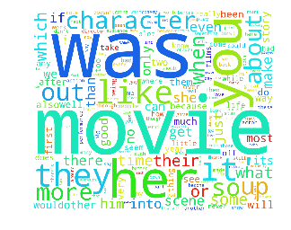
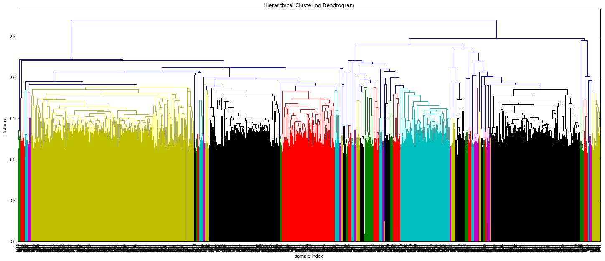

# computational_linguistics

used movie review data from http://www.cs.cornell.edu/people/pabo/movie-review-data/

the data are divided to two categories (pos/neg) and already sorted for cross-validation

computed uni-/bigrams and performed classification using linear regression and neural networks(MLP and CNN)

